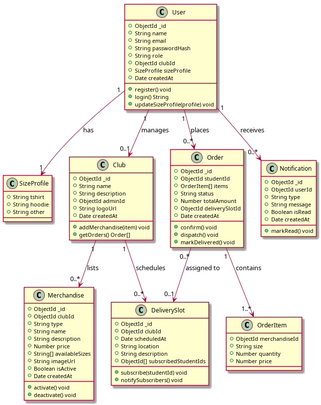
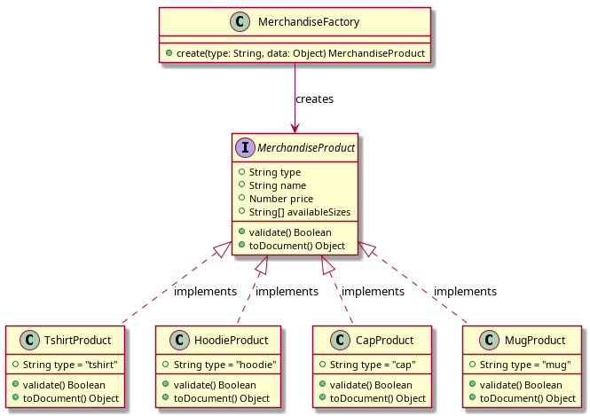
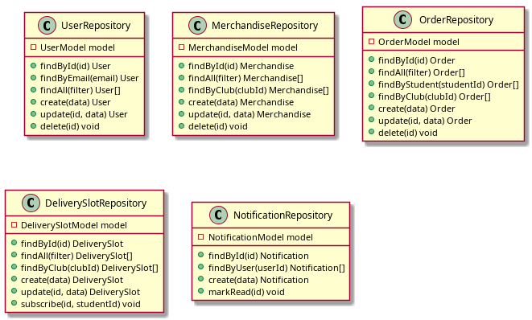
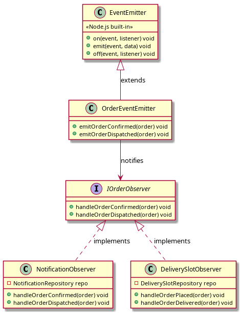
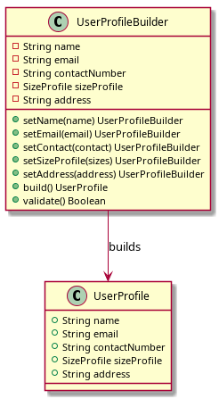
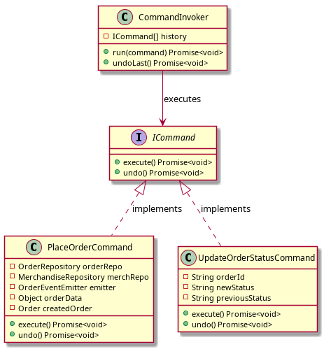
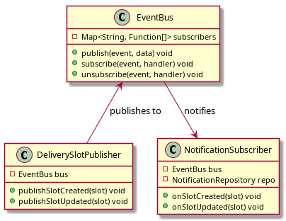

# UML Class Diagrams — Centralized College Merchandise Management System

## 1. Core Domain Model

---

## 2. Factory Pattern — MerchandiseFactory

---

## 3. Repository Pattern

---

## 4. Observer Pattern — OrderEventEmitter

---

## 5. Builder Pattern — UserProfileBuilder

---

## 6. Command Pattern — Order Commands

---

## 7. Pub-Sub Pattern — Delivery Notifications

