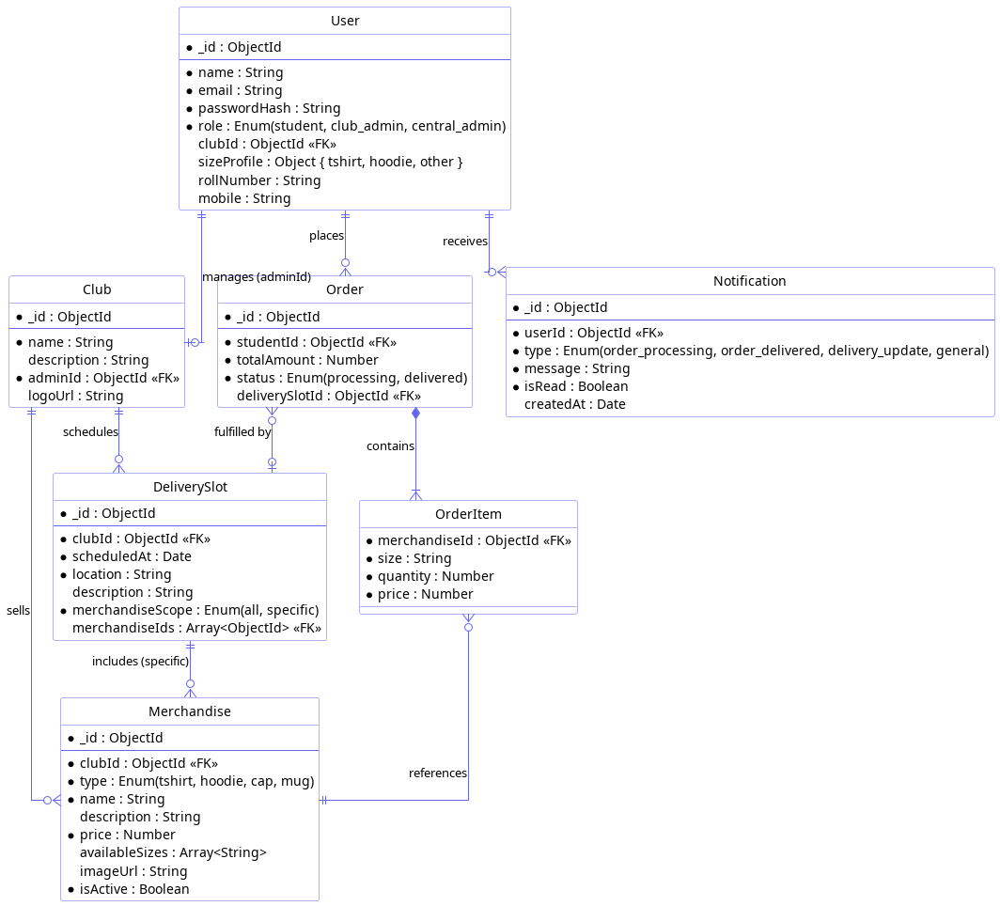
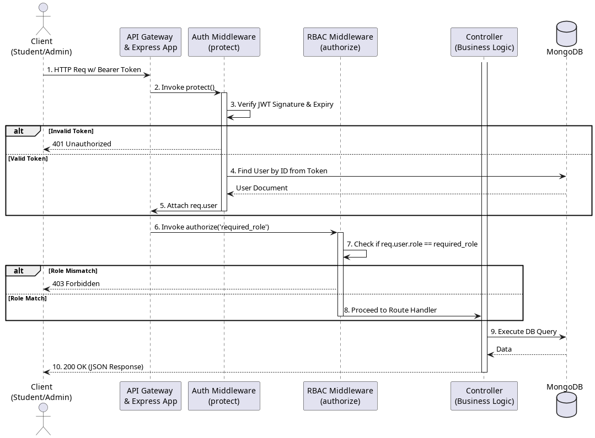

# Additional Architecture Diagrams

This document contains supplementary architecture diagrams referenced in the IEEE 42010 Stakeholders document: the Data View (ER Diagram) and the Security/Access View (API Architecture).

## 1. Information / Data Viewpoint (ER Diagram)

This Entity-Relationship diagram outlines the centralized Monolithic MongoDB schema. It demonstrates the relational structure across the unified catalog, illustrating how global profiles are linked to strict club-specific foreign keys (`clubId`) to guarantee data isolation.

---

## 2. Security & Access Viewpoint

This diagram represents the stateless security flow. It visualizes the execution sequence of the custom `authMiddleware` and `rbacMiddleware` (Role-Based Access Control) across the Express application, preventing unauthorized route execution.

