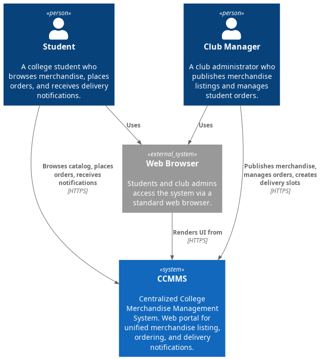
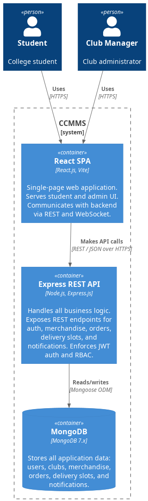
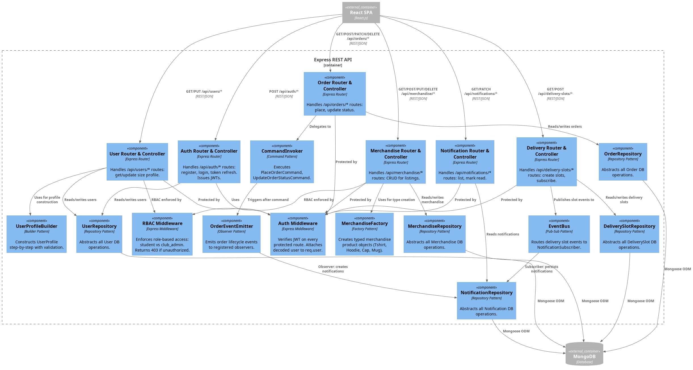

# C4 Architecture Diagrams — Centralized College Merchandise Management System

---

## Level 1 — System Context Diagram

> Shows how the CCMMS system fits into the world and who interacts with it.

---

## Level 2 — Container Diagram

> Shows the major containers (applications and data stores) inside CCMMS and how they interact.

---

## Level 3 — Component Diagram (Express REST API)

> Zooms into the Express REST API container, showing its internal components and their responsibilities.

---

## Architecture Layers Summary

| C4 Level | Focus | Diagram |
|----------|-------|---------|
| Level 1 — System Context | External actors + system boundary | Students, Club Admins → CCMMS → Email Service |
| Level 2 — Container | Technology containers + communication | React SPA ↔ Express API ↔ MongoDB |
| Level 3 — Component | Internal components of Express API | Routers, Middleware, Patterns, Repositories |
