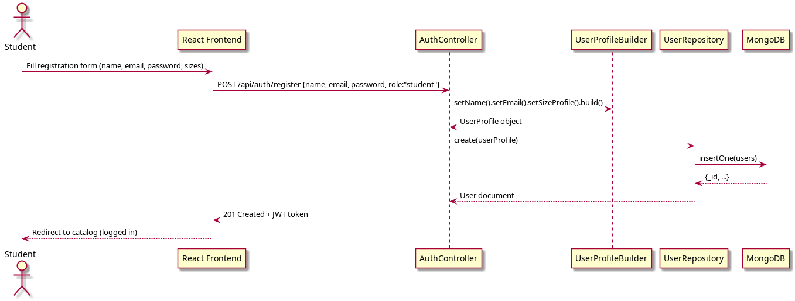
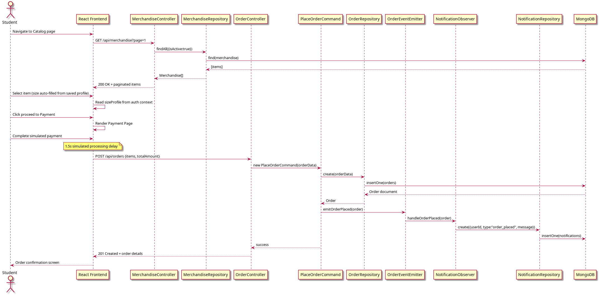
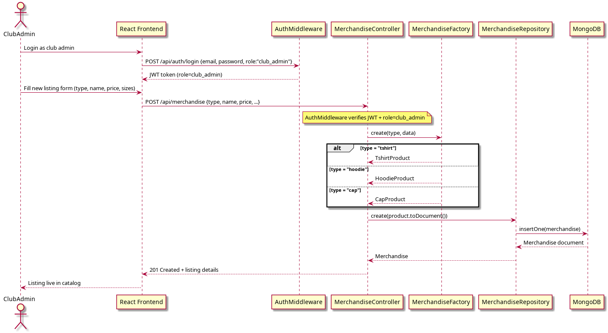
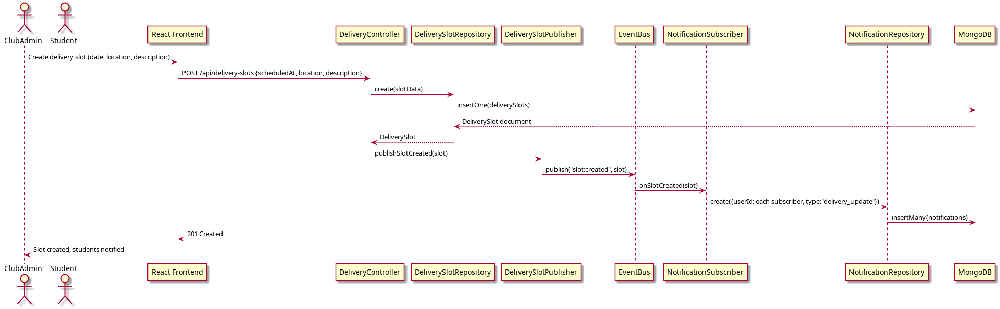
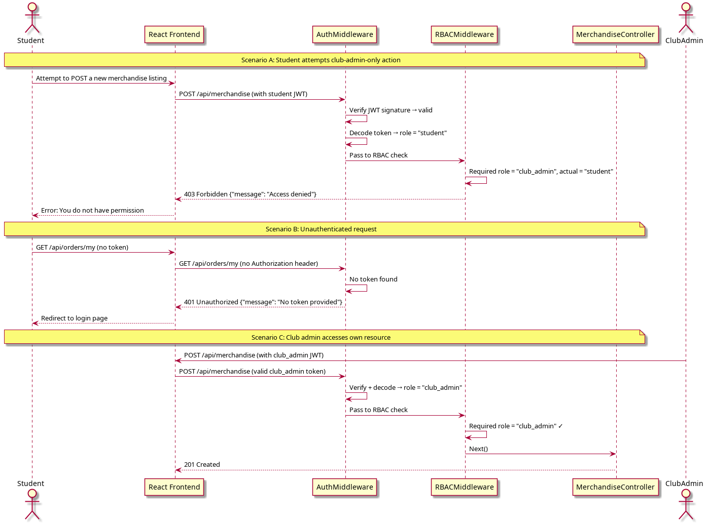
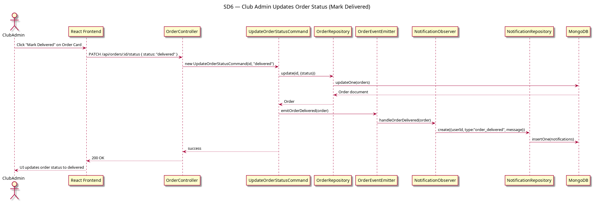

# UML Sequence Diagrams — Centralized College Merchandise Management System

## SD1 — Student Registration & Size Profile Setup (FR2, FR6)

---

## SD2 — Browse Catalog & Place Order (FR1, FR2, FR3)

---

## SD3 — Club Admin Publishes Merchandise Listing (FR5)

---

## SD4 — Delivery Slot Creation & Real-Time Student Notification (FR4)

---

## SD5 — Role-Based Access Control Enforcement (FR6)

---

## SD6 — Club Admin Updates Order Status (Mark Delivered)

